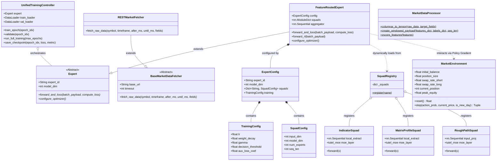

```mermaid
classDiagram
    %% --- Interfaces & Base Classes ---
    class Expert {
        <<Abstract>>
        +String expert_id
        +int model_dim
        +forward_and_loss(batch_payload, compute_loss)*
        +configure_optimizer()*
    }

    class BaseMarketDataFetcher {
        <<Abstract>>
        +String base_url
        +int timeout
        +fetch_raw_data(symbol, timeframe, after_ms, until_ms, fields)*
    }

    %% --- Configurations (Dataclasses) ---
    class ExpertConfig {
        +String expert_id
        +int model_dim
        +Dict~String, SquadConfig~ squads
        +TrainingConfig training
    }

    class SquadConfig {
        +int input_dim
        +int model_dim
        +int num_experts
        +int seq_len
    }

    class TrainingConfig {
        +float lr
        +float weight_decay
        +float gamma
        +float decision_threshold
        +float aux_loss_coef
    }

    %% --- Core Components ---
    class FeatureRoutedExpert {
        +ExpertConfig config
        +nn.ModuleDict squads
        +nn.Sequential aggregator
        +forward_and_loss(batch_payload, compute_loss)
        +forward_rl(batch_payload)
        +configure_optimizer()
    }

    class UnifiedTrainingController {
        +Expert expert
        +DataLoader train_loader
        +DataLoader val_loader
        +train_epoch(epoch_idx)
        +validate(epoch_idx)
        +run_full_training(max_epochs)
        +save_checkpoint(epoch_idx, loss, metric)
    }

    class SquadRegistry {
        -dict _squads
        +register(name)$
    }

    %% --- RL Environment (NEW) ---
    class MarketEnvironment {
        +float initial_balance
        +float position_size
        +float swap_rate_short
        +float swap_rate_long
        +int current_position
        +float peak_equity
        +reset() float
        +step(action_prob, current_price, is_new_day) Tuple
    }

    %% --- Squads (Neural Networks) ---
    class IndicatorSquad {
        +nn.Sequential local_extract
        +tutel_moe moe_layer
        +forward(x)
    }
    
    class MatrixProfileSquad {
        +nn.Sequential local_extract
        +tutel_moe moe_layer
        +forward(x)
    }
    
    class RoughPathSquad {
        +nn.Sequential input_proj
        +tutel_moe moe_layer
        +forward(x)
    }

    %% --- Data Utilities ---
    class RESTMarketFetcher {
        +fetch_raw_data(symbol, timeframe, after_ms, until_ms, fields)
    }

    class MarketDataProcessor {
        +columnar_to_tensor(raw_data, target_fields)$
        +create_windowed_payload(features_dict, labels_dict, seq_len)$
        +zscore_features(features)$
    }

    %% --- Relationships ---
    %% Inheritance
    FeatureRoutedExpert --|> Expert : extends
    RESTMarketFetcher --|> BaseMarketDataFetcher : extends

    %% Composition / Aggregation
    UnifiedTrainingController o-- Expert : orchestrates
    FeatureRoutedExpert *-- ExpertConfig : configured by
    ExpertConfig *-- TrainingConfig : contains
    ExpertConfig *-- SquadConfig : contains

    %% Registry Pattern
    FeatureRoutedExpert ..> SquadRegistry : dynamically loads from
    SquadRegistry o-- IndicatorSquad : registers
    SquadRegistry o-- MatrixProfileSquad : registers
    SquadRegistry o-- RoughPathSquad : registers
    
    %% RL Coupling
    FeatureRoutedExpert ..> MarketEnvironment : interacts via Policy Gradient
```