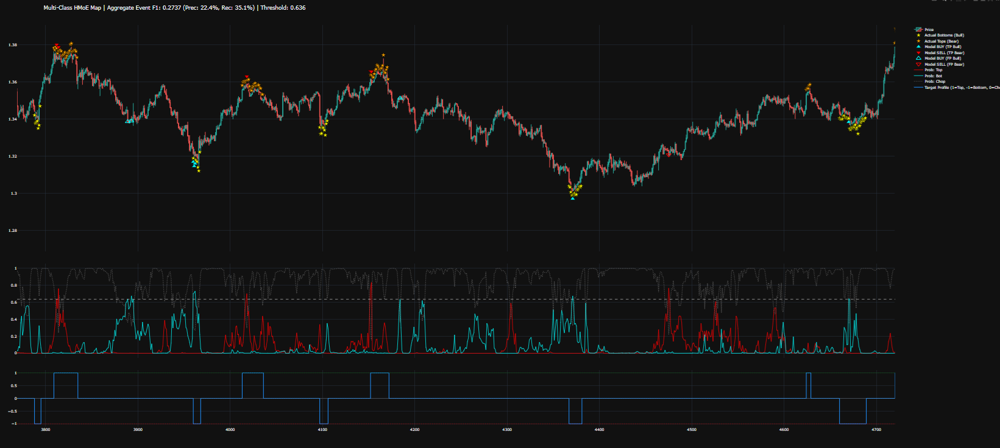

Note: This is an alpha release to prove a HMoE concept. Current focus is algorithmic trading but it can be used for any sparse event detection.

# Hierarchical Mixture-of-Experts (MoE) Pipeline

**Status:** Under Active Development | **Focus:** REVERSAL DETECTION | **Temporary Repository for validation**

This branch introduces a complete overhaul of the RPulsar machine learning backend. After extensive research and prototyping, we are transitioning from a monolithic dense network architecture to a high-performance **Hierarchical Mixture-of-Experts (MoE)** approach powered by **Microsoft Tutel**. 

Example what you can build with this, with some effort (untuned example): 



The above example is OOS and untuned. Given the limited feature-set the results are very promising.

At the pinnacle of this architecture sits a deterministic macro-router that fundamentally strips the neural network of high-level guesswork. Instead of allowing a traditional, black-box gating network to estimate the overarching market environment, this root node acts as an uncompromising mathematical gatekeeper driven by a strictly defined moving average regime filter. By evaluating whether the market is in a validated uptrend, downtrend, or untradeable chop, the router dynamically masks the tensor pathways in real-time. This ensures that entire sub-trees of the model are hard-pruned from the computational graph the moment their specific market conditions are absent, instantly halting capital deployment during sideways chop and preserving both processing power and gradient integrity.

Beneath this macro-routing layer lies an asymmetric, hierarchical deployment of specialized expert squads, intentionally unbalanced to reflect the divergent realities of bull and bear markets. When the root node detects a bullish regime, it activates a neural sub-router exclusively fed with bottom-finding candlestick heuristics and momentum oscillators tailored to accurately buy the dip. Conversely, a bearish regime triggers a completely separate squad of experts trained explicitly on top-reversal patterns to aggressively short the rip. This intentional asymmetry is crucial; it prevents the network from wasting parameter capacity on bullish continuation patterns during a market crash, forcing the active experts to become hyper-specialized snipers for their designated market phase.

The true elegance of this system is realized in the data pipeline and loss calculation, which seamlessly bridge the deterministic routing with the neural backpropagation. The pipeline dynamically synthesizes a unified target tensor on the fly, feeding bottom-labels to the loss function during uptrends and top-labels during downtrends. Because the root router only allows the regime-appropriate experts to generate logits at any given timestep, the PyTorch loss function naturally penalizes and rewards the correct subnetworks without requiring the neural architecture to explicitly comprehend the shifting targets. This creates a beautifully isolated training environment where quantitative macro-rules dictate the battleground, and deep learning is left to purely optimize the tactical execution.

The problems that "are solved" (depends on your features stack):

- Extreme class imbalance (sparsity): Handled via targeted focal loss and by isolating the "hunting grounds" so the network isn't drowned in endless zeros.

- Monolithic feature processing (The "Muddle"): Solved by ensuring each indicator class (RSI, Candlesticks, MACD) has its own dedicated "brains" (Expert Squads) to learn domain-specific patterns before fusion.

- Neural networks guessing macro trends: Solved by decoupling trend identification from pattern recognition, using static routing via a deterministic macro regime filter to dictate the battleground.

- Capital bleed in sideways markets (The "Chop"): Solved by the root router's 0 state, which instantly masks out non-trending regimes and prevents the network from overtrading unpredictable noise.

- Contextual feature contradiction: Solved through Asymmetric Expert Isolation. By stripping bullish signals (like Hammers) from the Bear Squad and vice versa, the network never wastes parameter capacity evaluating noise that conflicts with the macro trend.

- Dynamic target ambiguity: Solved by on-the-fly target synthesis. The pipeline dynamically swaps the ground-truth labels (feeding "bottoms" during uptrends and "tops" during downtrends) seamlessly to the loss function based on the active regime.

- Look-ahead bias (Data Leakage): Solved mathematically at the base layer utilizing strictly causal, asymmetrically left-padded Temporal Convolutional Networks (TCNs). Future price action is physically blocked from contaminating the current state tensor.

- Computational/Parameter bloat: Solved by sparse activation. Because of the MoE gating and Depthwise Separable Convolutions, only a highly specialized fraction of the network's parameters are calculated and updated at any given timestep, saving massive VRAM and compute.

- The "Black-Box" dilemma: Solved by the integrated chunked parallel occlusion pipeline. The architecture doesn't just give you a confidence score; it mathematically attributes that score back to the exact features (e.g., RSI or a specific Doji) that caused the experts to fire.

Note: a general rule is "garbage in, garbage out". You need to make superb features in order to make it reliable and make it perform well. The engine should be solid. I am developing on top of it and it gets better and better with feature improvements. When trading with this structure, implement proper guardrails. Eg cover for macro shocks.

✅ With well-engineered features, this setup could detect reversals reliably for:

- Short-term sequences (intraday or minute-level)
- Structured features (indicators, returns, momentum)

⚠️ Reliability drops if:

- Features are sparse or noisy
- Sequence length does not capture enough context (configurable)

---

## Who is this for?

This is **not** a beginner-friendly "click and run" trading bot.  
It is aimed at:
- Experienced retail / semi-pro quants who already have a solid data pipeline
- Developers comfortable with PyTorch, CUDA, and MoE architectures
- Researchers interested in sparse event detection and regime-aware modeling

If you're new to ML or algorithmic trading, this repository will likely be overwhelming.

---

## Prerequisites

- NVIDIA GPU with CUDA support (RTX 3070 or better recommended)
- WSL2 (Ubuntu) environment strongly recommended
- Working installation of `bp.markets.ingest` with HTTP API running on port 8000
- Proper pivot-finder labels configured in your data pipeline (smear labels, eg 4 after pivot)
- Basic familiarity with PyTorch and MoE concepts

---

## 🎯 The Goal: A Surgical Pipeline

Standard dense neural networks struggle in financial markets because they are forced to process every market regime using the same shared weights. A model trying to learn the geometric structure of a V-bottom gets "lobotomized" when forced to simultaneously process a sparse, high-impact macro shock like an NFP release.

**The Solution:** We are building a pipeline where each sub-model (an "Expert") is encapsulated and optimized strictly for its specific signal-to-noise ratio. The Tutel Gateway acts as the orchestrator, dynamically routing our 24-candle H4 frames (later other TF, H4 remains the focus because of performance) to the exact expert qualified to interpret the current market regime.

**Previously:** Previously we had a hybrid of Macro Stencil with RNN. While this model works pretty well, I am using it atm, the problem remains that it is fairly complex because it combines multiple approaches in a single model/engine. It's easy to introduce bugs. We are now going to split up the models and each of the models will get its specific "knowledge domain".

---

## 🧠 The Expert Modules

Instead of one massive model, we will train multiple specialized, lightweight models. Each expert owns a specific domain of the market data.

Models can be routed using neural nets or deterministic rules.

---

## ⚙️ Core Infrastructure: Microsoft Tutel

To make this computationally feasible for retail cloners and researchers without requiring enterprise data centers, we use **Microsoft Tutel**.

* **Dynamic Gating:** Tutel provides high-performance CUDA kernels that handle the "All-to-All" communication. It evaluates the gating features (e.g., current volatility, time-to-event) and routes the 24-candle token strictly to the Top-K experts.
* **Sparsity Handled:** By utilizing "Expert Dropout" and a Shared "Null" Expert for sideways noise, we prevent specialized models (like the Macro Expert) from hallucinating during quiet market hours.
* **Mechanical Sympathy:** The MoE allows us to scale the intellectual capacity of the bot massively without a linear increase in VRAM or inference latency. 

---

## 🛠️ Developer UX & Setup

This upgrade embraces Infrastructure-as-Code. The setup process for cloners is being streamlined into a single execution script (`setup.sh`) that automatically handles CMake upgrades, specific Clang compiler requirements, and native CUDA architecture targeting to ensure Tutel compiles flawlessly on your specific silicon.

## Quick Setup

### 📦 1. Installation

**Clone the Repository:**
```bash
git clone https://github.com/jpueberbach4/bp.markets.ml-alpha.git
cd bp.markets.ml
```

**Environment Setup:**

We recommend using Python 3.9+ and a virtual environment.

```bash
./setup.sh
```

After, for each WSL window you start, you will need to (re)activate the venv environment

```sh
source ./venv/bin/activate
```

## ⚙️ 2. Configuration Overrides

The system is designed with a Base-Override architecture. Do not modify config.py directly. Instead, create a config.user.py to store your private "Champion" parameters.

Create config.user.py (from config.py):

```bash
cp config.py config.user.py
```

Put any overrides in config.user.py. You need to put overrides in there since the configuration is not optimal. See below.

**Note: Remove the config.user include block from the bottom of the file, in case you have copied from config.py.**

### 3. Data

This engine uses the HTTP API of the `bp.markets.ingest` project. Make sure the data for your asset is available and the API service is running on port 8000.

## 4. Configuration

(I cannot share my config/strategy. If you want to use this, you will need to write your own data pipeline. There is an untuned example config available)

## 5. Initial execution

```bash
./train.sh
```

This will perform some steps:

- Train
- Verify gating and expert distribution
- Plots the example bottom/tops detects to a web-window

## 6. Future

- Multihead attention will be added to get multiple outputs (eg vola info, sentiment info, ...)
- Will be used for live-trading

## 7. Example distribution

```sh
--- EXPERT ROUTING DISTRIBUTION ---

NODE: [ROOT_LOCAL_FEATURES] | Total Tokens Routed: 4980
------------------------------------------------------------
 Expert 0  | 05.54% | ██
 Expert 1  | 46.87% | ███████████████████████
 Expert 2  | 13.55% | ██████
 Expert 3  | 34.04% | █████████████████

NODE: [ROOT_ROUTER] | Total Tokens Routed: 14940
------------------------------------------------------------
 Expert 0  | 49.02% | ████████████████████████
 Expert 1  | 22.22% | ███████████
 Expert 2  | 15.72% | ███████
 Expert 3  | 13.04% | ██████

NODE: [CHOP_SQUAD] | Total Tokens Routed: 4980
------------------------------------------------------------
 Expert 1  | 64.60% | ████████████████████████████████
 Expert 5  | 34.54% | █████████████████
 Expert 7  | 00.86% |

NODE: [DETECT_BOTTOMS.CANDLESTICK] | Total Tokens Routed: 4980
------------------------------------------------------------
 Expert 0  | 10.82% | █████
 Expert 1  | 04.42% | ██
 Expert 2  | 60.26% | ██████████████████████████████
 Expert 3  | 01.89% |
 Expert 4  | 00.36% |
 Expert 5  | 07.79% | ███
 Expert 6  | 05.48% | ██
 Expert 7  | 08.98% | ████

NODE: [DETECT_BOTTOMS.INDICATOR] | Total Tokens Routed: 4980
------------------------------------------------------------
 Expert 0  | 15.98% | ███████
 Expert 1  | 01.37% |
 Expert 2  | 06.12% | ███
 Expert 3  | 07.77% | ███
 Expert 4  | 19.36% | █████████
 Expert 5  | 17.25% | ████████
 Expert 6  | 16.91% | ████████
 Expert 7  | 15.24% | ███████

NODE: [DETECT_BOTTOMS.RSI] | Total Tokens Routed: 4980
------------------------------------------------------------
 Expert 0  | 08.53% | ████
 Expert 1  | 14.20% | ███████
 Expert 2  | 07.61% | ███
 Expert 3  | 20.94% | ██████████
 Expert 4  | 07.85% | ███
 Expert 5  | 21.89% | ██████████
 Expert 6  | 08.05% | ████
 Expert 7  | 10.92% | █████

NODE: [DETECT_BOTTOMS_LEAF] | Total Tokens Routed: 4980
------------------------------------------------------------
 Expert 7  | 100.00% | ██████████████████████████████████████████████████

NODE: [DETECT_BOTTOMS_ROUTER] | Total Tokens Routed: 14940
------------------------------------------------------------
 Expert 0  | 16.47% | ████████
 Expert 1  | 13.55% | ██████
 Expert 2  | 12.87% | ██████
 Expert 3  | 08.98% | ████
 Expert 4  | 18.28% | █████████
 Expert 5  | 15.83% | ███████
 Expert 6  | 04.89% | ██
 Expert 7  | 09.14% | ████

NODE: [DETECT_TOPS.CANDLESTICK] | Total Tokens Routed: 4980
------------------------------------------------------------
 Expert 0  | 10.34% | █████
 Expert 1  | 31.20% | ███████████████
 Expert 2  | 01.02% |
 Expert 3  | 00.74% |
 Expert 4  | 15.34% | ███████
 Expert 5  | 34.74% | █████████████████
 Expert 6  | 00.46% |
 Expert 7  | 06.14% | ███

NODE: [DETECT_TOPS.INDICATOR] | Total Tokens Routed: 4980
------------------------------------------------------------
 Expert 0  | 13.55% | ██████
 Expert 1  | 13.09% | ██████
 Expert 2  | 33.96% | ████████████████
 Expert 3  | 02.15% | █
 Expert 4  | 21.93% | ██████████
 Expert 5  | 04.34% | ██
 Expert 6  | 09.44% | ████
 Expert 7  | 01.55% |

NODE: [DETECT_TOPS.RSI] | Total Tokens Routed: 4980
------------------------------------------------------------
 Expert 0  | 10.68% | █████
 Expert 1  | 07.07% | ███
 Expert 2  | 13.09% | ██████
 Expert 3  | 09.74% | ████
 Expert 4  | 14.62% | ███████
 Expert 5  | 18.90% | █████████
 Expert 6  | 08.13% | ████
 Expert 7  | 17.77% | ████████

NODE: [DETECT_TOPS_LEAF] | Total Tokens Routed: 4980
------------------------------------------------------------
 Expert 0  | 52.63% | ██████████████████████████
 Expert 1  | 47.37% | ███████████████████████

NODE: [DETECT_TOPS_ROUTER] | Total Tokens Routed: 14940
------------------------------------------------------------
 Expert 0  | 20.98% | ██████████
 Expert 1  | 19.38% | █████████
 Expert 2  | 12.39% | ██████
 Expert 3  | 06.55% | ███
 Expert 4  | 05.94% | ██
 Expert 5  | 11.73% | █████
 Expert 6  | 08.52% | ████
 Expert 7  | 14.50% | ███████

================================================================================

--- NODE ATTENTION WEIGHTS (MACRO ROUTING) ---
 attn_root->chop_squad                    | 00.28% |
 attn_root->detect_bottoms                | 50.77% | █████████████████████████
 attn_root->detect_tops                   | 48.95% | ████████████████████████
 attn_root.detect_bottoms->candlestick    | 04.93% | ██
 attn_root.detect_bottoms->indicator      | 19.79% | █████████
 attn_root.detect_bottoms->rsi            | 75.28% | █████████████████████████████████████
 attn_root.detect_tops->candlestick       | 03.97% | █
 attn_root.detect_tops->indicator         | 20.68% | ██████████
 attn_root.detect_tops->rsi               | 75.35% | █████████████████████████████████████

================================================================================
```

# LICENSE?

MIT. Do as you please with it.
